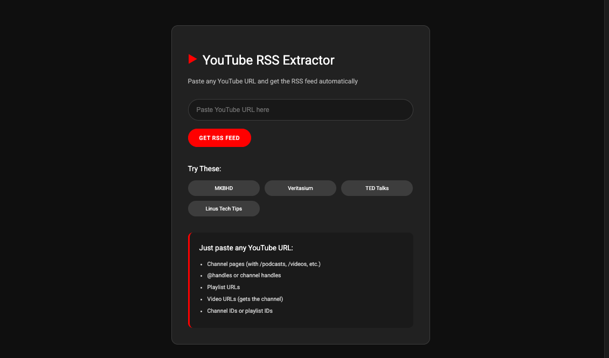

# YouTube RSS Extractor



A simple web tool that converts any YouTube URL into an RSS feed. Paste any YouTube channel, playlist, or video URL and get the corresponding RSS feed automatically.

## Features

- **Universal URL Support**: Works with channel URLs, @handles, playlist URLs, and video URLs
- **Automatic Conversion**: Converts @handles to channel IDs using web scraping
- **No API Keys Required**: Client-side only, no backend or authentication needed
- **RSS Feed Generation**: Creates proper RSS feed URLs for channels and playlists
- **Copy to Clipboard**: One-click copying of generated RSS URLs
- **Mobile Responsive**: Works on all devices

## Supported URL Formats

- Channel handles: `@mkbhd`, `@veritasium`
- Channel URLs: `youtube.com/@channel/podcasts`, `youtube.com/c/channelname`
- Channel IDs: `UCBJycsmduvYEL83R_U4JriQ`
- Playlist URLs: `youtube.com/playlist?list=PLxxxxx`
- Video URLs: `youtube.com/watch?v=xxxxxx` (extracts channel)

## How It Works

1. **URL Analysis**: Parses the input to determine if it's a channel, playlist, or video URL
2. **Handle Resolution**: For @handles, scrapes the YouTube page to extract the channel ID
3. **RSS Generation**: Creates the appropriate RSS feed URL using YouTube's feed endpoints
4. **CORS Handling**: Uses proxy services to bypass browser CORS restrictions

<small>*When a YouTube handle is entered, the browser can't directly fetch YouTube's page because of CORS security rules that prevent websites from accessing other domains. To get around this, the program uses a proxy service as a middleman.*</small>

<small>*The browser makes a request like `fetch('https://api.allorigins.win/raw?url=' + encodeURIComponent('https://www.youtube.com/@handle'))` - essentially asking the proxy server "please go get this YouTube page for me." The proxy server (running on api.allorigins.win) receives this request and understands that it needs to fetch the YouTube page on behalf of the browser.*</small>

<small>*The proxy then makes its own server-to-server request directly to the YouTube URL on their backend. YouTube responds normally to the proxy server because it's a legitimate server making the request, not a browser trying to access cross-origin content.*</small>

<small>*YouTube sends back thousands of lines of HTML containing all the page data, including embedded JavaScript with the channel ID like `"channelId":"UC1234567890123456789012"`. The proxy server then forwards this entire HTML response back to the browser with special CORS headers that tell the browser "this content is safe to use."*</small>

<small>*The browser receives the full YouTube page source as a text string through `const html = await response.text()`, and the JavaScript can then search through this HTML string using regex patterns like `html.match(/"channelId":"(UC[a-zA-Z0-9_-]{22})"/)` to extract the channel ID, which gets turned into the final RSS feed URL.*</small>


### Channel ID Extraction

For @handles and custom URLs, the tool uses web scraping to find the channel ID:

```javascript
// Uses CORS proxies to fetch YouTube pages
const proxies = [
  "https://api.allorigins.win/raw?url=",
  "https://corsproxy.io/?",
];

// Searches HTML for channel ID patterns
const patterns = [
  /"channelId":"(UC[a-zA-Z0-9_-]{22})"/,
  /<meta itemprop="channelId" content="(UC[a-zA-Z0-9_-]{22})">/,
];
```

### RSS Feed Endpoints

- **Channels**: `https://www.youtube.com/feeds/videos.xml?channel_id=UC...`
- **Playlists**: `https://www.youtube.com/feeds/videos.xml?playlist_id=PL...`

## Usage

1. Open the web application
2. Paste any YouTube URL into the input field
3. Click "Get RSS Feed"
4. Copy the generated RSS feed URL
5. Add the RSS URL to your feed reader

**_Want to make a scrolling ticker for your frontend project?_**

- https://github.com/DevManSam777/rss-ticker

## License

[LICENSE](LICENSE)  

Copyright (c) 2025 DevManSam
